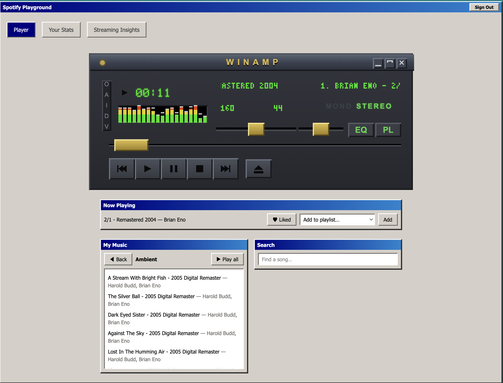

# RetroPlayer

A Spotify client that looks like it's from 2001. Win98 chrome, a pixel-faithful Winamp 2.x player, and your real library behind it — plus analytics over your full listening history that Spotify doesn't surface.

## What it does

**The player** — a Winamp-skinned player playing your actual Spotify library. Browse your playlists and Liked Songs, search, click a track to play it with the rest of the results queued behind it, like and unlike, add what's playing to a playlist. The whole app is Win98: teal desktop, silver beveled windows, navy title bars, Tahoma.

**Your stats** — top artists, tracks, and albums across short, medium, and long time ranges, with detail popups.

**Streaming insights** — Spotify's own stats only reach back so far. Request your full data export from Spotify, upload the zip here, and it becomes a listening heatmap and multi-year trend graphs covering everything you've ever played. The zip is read in your browser and never uploaded anywhere.

## Getting access

The Spotify app is in development mode, which caps it at **25 allowlisted users** — accounts have to be added by hand before login will work. Open an issue if you want in.

You also need **Spotify Premium**. Spotify's playback SDK refuses to stream for free accounts, so the player won't work without it; the stats and streaming insights will.

## Known limits

- Visualizers are simulated rather than audio-reactive — Spotify's audio is DRM'd, so nothing can read the actual waveform.
- Long sessions need an occasional re-login.

---

Running it locally, environment setup, and architecture: [AGENTS.md](AGENTS.md).
